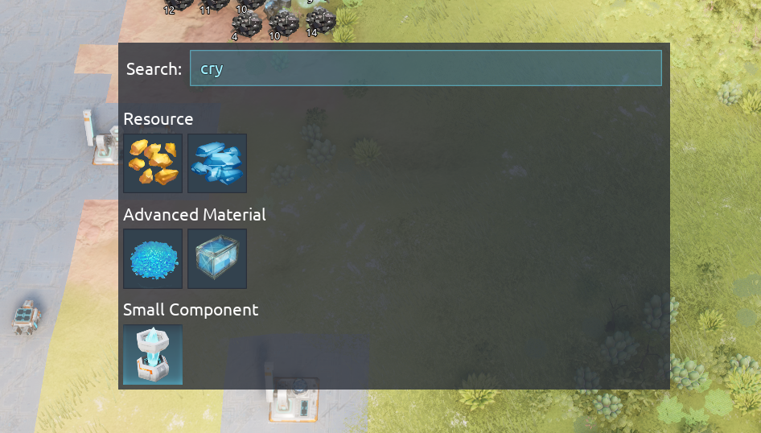
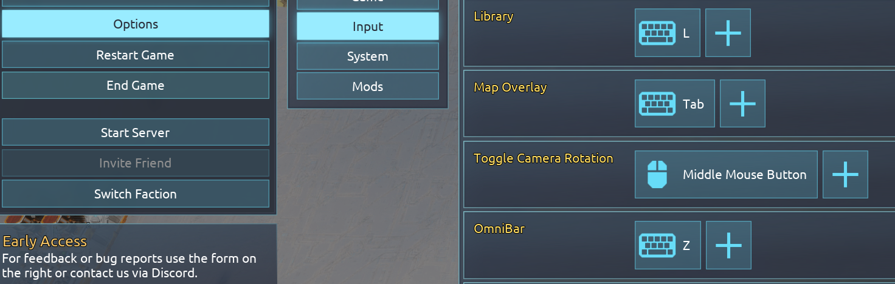
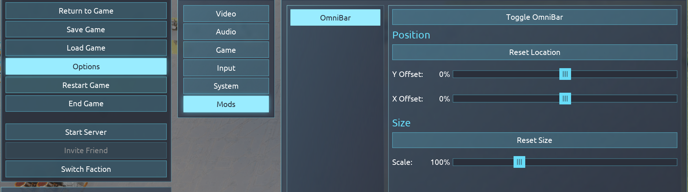

# Desynced OmniBar

Default keybind: `Z`
Close Keybind: `ESCAPE`

TODO(maz): Make close configurable?

Pops up an omnibar that searches all unlockables available to your faction. Hovering an item in the results works the same as any other interface, including the ability to hold modifiers (`Ctrl`/`Alt`/`Shift`) to see more info.

Clicking anywhere outside the omnibar will also immediately close it.

## Settings

Hotkey is configurable from the main `Input` menu, like all other keybinds.

The location and size of the bar can be configured in the mod menu. If loaded into a game, clicking `Toggle OmniBar` will display the bar and allow the sliders to affect it live.

If not loaded into a game, the sliders may be changed but will you will be unable to toggle the bar on.

## Potential Additions

- Link items/components to faction item view
- Search Codex Entries
- Search Research
- Search Settings
- Calculator? (Like satisfactory)
- Search Library